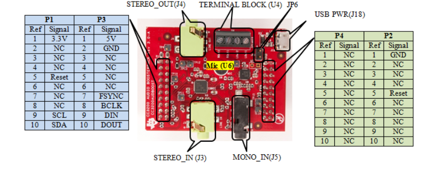

# SimpleLink&trade; CC2745R10-Q1 LaunchPad&trade; Settings & Resources

The [__SimpleLink&trade; CC2745R10-Q1 LaunchPad&trade;__][board] contains a
[__CC2745R10E0WRHARQ1__][device] device.

## Jumper Settings

* Close the __`LEDs`__ jumpers to enable the on-board LEDs.

## TI BoosterPacks&trade;

The following BoosterPacks are used with some driver examples.

### [__BP-BASSENSORSMKII BoosterPack__][bp-bassensorsmkii]

The TMP116's power pin is not compatible with this LaunchPad. Use the
following modification to enable the TMP116's usage with the
__i2ctmp__ and __portable__ examples.

* Use a jumper wire to connect BoosterPack pin header BP.28 (__`T_V+`__) to BP.1 (__`3V3`__).

The OPT3001's power and interrupt pins are not compatible with this LaunchPad. Use the
following modification to enable the OPT3001's usage with the
__i2copt3001_cpp__ example.

* Use a jumper wire to connect BoosterPack pin header BP.27 (__`O_V+`__) to BP.18 (unlabeled).
* Use a jumper wire to connect BoosterPack pin header BP.25 (__`O_INT`__) to BP.7 (__`P05`__).

### [__BOOSTXL-SHARP128 LCD & SD Card BoosterPack__][boostxl-sharp128]

* BoosterPack pin header BP.8 (__`SD_CS`__) must be jumpered to BP.9 when using the SD card.

### [__CC3200 Audio BoosterPack__][cc3200audboost]

The BoosterPack's `DIN`, `BCLK` and `FSYNC`/`WCLK` signal pins are not
compatible with this LaunchPad. Use one of the following modifications to enable
the CC3200 Audio BoosterPack's usage with the __i2secho__ example.

#### Option 1: Jumper Wires

Attach the CC3200 Audio BoosterPack to the LP_EM_CC2745R10_Q1 and run jumper wires
between the following pins on the CC3200 Audio BoosterPack:

* DIN: `P4.3` and `P3.9`
* BCLK: `P4.9` and `P3.8`
* FSYNC/WCLK: `P4.10` and `P3.7`

See [Audio BP User Guide][cc3200audboost-user-guide] (Figure 2-1), or the diagram
below, for information on where these pins are located.

#### Option 2: Soldering

Alternatively, move 0-ohm resistors on LP_EM_CC2745R10_Q1 to make it compatible with
the CC3200 Audio BoosterPack:

* DIN: Remove `R77` and mount `R76`
* BCLK: Remove `R72` and mount `R75`
* FSYNC/WCLK: Remove `R74` and mount `R74`

### [__BP-EM-CS BoosterPack__][bp-em-cs]

When using a CC27XX board, connect the P1 and P2 jumpers, and disconnect the P3
and P4 jumpers on the BoosterPack. Add only the VC pins labelled CC27XX in
SysConfig and make sure they are configured as output.

The VC pins are used to select the antenna on the BoosterPack:

|     | RF1 (J2) | RF2 (A1) | RF3 (A2) | RF4 (J3) |
|-----|----------|----------|----------|----------|
| VC1 | 0        | 0        | 1        | 1        |
| VC2 | 0        | 1        | 0        | 1        |

[device]: https://www.ti.com/product/CC2745R10-Q1
[board]: https://www.ti.com/tool/LP-EM-CC2745R10-Q1
[bp-bassensorsmkii]: https://www.ti.com/tool/BP-BASSENSORSMKII
[boostxl-sharp128]: https://www.ti.com/tool/BOOSTXL-SHARP128
[cc3200audboost]: https://www.ti.com/tool/CC3200AUDBOOST
[cc3200audboost-user-guide]: https://www.ti.com/lit/pdf/swru383
[bp-em-cs]: https://www.ti.com/tool/BP-EM-CS
