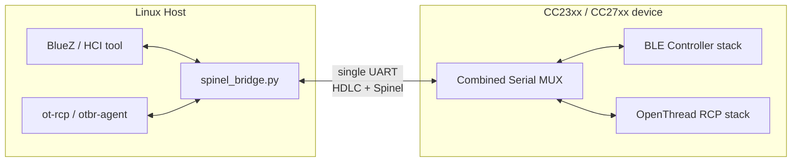
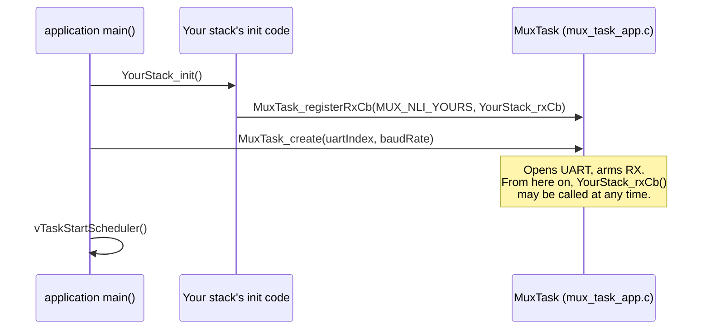

# TI Combined Serial MUX — User / API Guide

> Audience: firmware engineers integrating a protocol stack (BLE, OpenThread,
> Zigbee, or a new one) with the Combined Serial MUX, and host-side engineers
> writing or debugging the Linux-side bridge. For internal design rationale
> and data structures, see [DESIGN.md](DESIGN.md).

## 1. What this module does

The Combined Serial MUX multiplexes several independent protocol stacks over
a **single physical UART** between an embedded device (CC23xx/CC27xx) and a
Linux host. Each stack is identified by a **Network Layer Identifier (NLI)**
carried in a one-byte Spinel-style header; frames are delimited with HDLC
framing and protected by a CRC-16/Kermit checksum.



One physical UART link replaces what would otherwise require one UART per
stack — the tradeoff is that all stacks share the link's bandwidth and must
play by the MUX's framing and NLI rules.

## 2. Wire protocol at a glance

```
[0x7E] [Spinel header] [Spinel CMD (packed-uint)] [payload ...] [CRC16 lo] [CRC16 hi] [0x7E]
```

- **`0x7E`** — HDLC flag byte, marks the start and end of every frame. A
  closing flag doubles as the next frame's opening flag.
- **Escaping** — any `0x7E` or `0x7D` byte inside the payload/CRC is escaped
  as `0x7D` followed by `(byte ^ 0x20)`.
- **Spinel header** — one byte: `0x80 | (NLI << 4) | TID`. `TID` is always 0
  in this protocol (no request/response correlation at the MUX layer).
- **Spinel CMD** — a packed unsigned integer (`SPINEL_CMD_PROP_VALUE_IS` /
  `_SET`, or a keepalive command ID).
- **CRC-16/Kermit** — computed over the unescaped header+CMD+payload, sent
  little-endian, itself subject to escaping.

| NLI | Macro                 | Meaning                                   |
|-----|-----------------------|--------------------------------------------|
| 0   | `MUX_NLI_OT`           | OpenThread / Thread RCP traffic            |
| 1   | `MUX_NLI_BLE`          | BLE HCI traffic                            |
| 2   | `MUX_NLI_ZB`           | Zigbee MAC traffic                         |
| 3   | `MUX_NLI_KEEPALIVE`    | Link keepalive (`CMD_KEEPALIVE`/`_ACK`)    |

In the `rcp_ble_controller` reference build, `MUX_NLI_OT` and `MUX_NLI_BLE`
are both active; `MUX_NLI_ZB` is defined by the protocol but not wired up
(no Zigbee stack in that build).

## 3. Quick start: adding a new stack

Registering a stack with the MUX is a two-step contract, always in this
order:



**Step 1 — register your RX callback before `MuxTask_create()`:**

```c
#include "ti/dmm/combined_serial/embedded/mux_task_app.h"
#include "ti/dmm/combined_serial/mux_common.h"

static void YourStack_rxCb(const uint8_t *buf, uint16_t len)
{
    /* Runs in UART ISR context — see §4 before writing this function. */
    YourStack_handleInboundFrame(buf, len);
}

void YourStack_init(void)
{
    MuxTask_registerRxCb(MUX_NLI_YOURS, YourStack_rxCb);
}
```

**Step 2 — send outbound packets from any task, any time after `MuxTask_create()`:**

```c
MuxErr_t err = MuxTask_sendPacket(MUX_NLI_YOURS, pPacket, packetLen);
if (err != MUX_SUCCESS) {
    /* MUX_ERR_INVALID: NULL/zero-length/oversized packet or bad NLI —
     * a programming error, not a transient condition. */
}
```

That's the entire integration surface. `MuxTask_create()` itself is called
**once**, from `main()`, after all stacks have registered their callbacks:

```c
int main(void)
{
    YourStack_init();          /* registers RX callback */
    ThreadMux_init();          /* registers MUX_NLI_OT   */
    MuxTask_registerRxCb(MUX_NLI_BLE, MuxVirtUart_rxNotify);

    if (MuxTask_create(CONFIG_UART2_0, 921600) != MUX_SUCCESS) {
        /* handle fatal UART-open failure */
    }
    vTaskStartScheduler();
}
```

## 4. The one rule that matters: RX runs in the UART ISR

There is no RX task. Every registered `MuxStackRxCb_t` callback — and
everything it calls — executes **synchronously inside the UART hardware
interrupt**, before the next byte is even read. This is a deliberate design
choice (see [DESIGN.md §3](DESIGN.md#3-rx-path-isr-only-no-task) for why),
but it means your callback must be **ISR-safe**:

- No blocking calls of any kind.
- No FreeRTOS/ICall API unless it is explicitly documented as ISR-safe (a
  `*FromISR` variant, or one that internally branches on `HwiP_inISR()`).
- Bounded, short execution time — your callback directly extends UART
  interrupt latency for every other interrupt in the system while it runs.

If your callback needs to hand data off to a task, use an ISR-safe
primitive (`xQueueSendFromISR`, `xTaskNotifyFromISR`, etc.) and do the real
work in that task — do not process the packet in place if that would take
more than a few microseconds.

`MuxTask_sendPacket()`, by contrast, runs in **your own task's context** —
call it like any other blocking API. It is thread-safe and may be called
concurrently from multiple tasks.

## 5. API reference

### `mux_task_app.h`

| Function | Context | Blocking? | Purpose |
|---|---|---|---|
| `MuxTask_registerRxCb(nli, cb)` | Any task, before `MuxTask_create()` | No | Register the callback invoked for inbound packets on `nli`. |
| `MuxTask_create(uartIndex, baudRate)` | `main()`, before `vTaskStartScheduler()` | No | Opens the UART, arms RX, creates the keepalive task. |
| `MuxTask_sendPacket(nli, buf, len)` | Any task | Yes — until UART TX completes | Encode + transmit one packet on `nli`. |

### `mux_uart.h` (lower layer — most integrators won't call this directly)

| Function | Purpose |
|---|---|
| `MuxUart_open(uartIndex, baudRate, rxHandler)` | Opens the physical UART2 instance. Called once, by `MuxTask_create()`. |
| `MuxUart_write(buf, len)` | Blocking write of one already-encoded HDLC frame. Callers must serialize (the MUX task's TX lock does this). |
| `MuxUart_close(void)` | Stops RX and closes the UART. |

### `hdlc_spinel.h` (protocol codec — used internally, and by host tooling)

| Function | Purpose |
|---|---|
| `MuxSpinelHdlc_encode(nli, cmd, payload, payloadLen, scratchBuf, scratchMaxLen, outBuf, outMaxLen, &outLen)` | One-call encode: builds the Spinel frame in your scratch buffer, then HDLC-frames it into `outBuf`. |
| `MuxHdlc_decode(frame, frameLen, outBuf, outMaxLen, &outLen)` | Strips flags, unescapes, verifies CRC. Returns `MUX_ERR_CRC` on mismatch. |
| `MuxSpinel_parseFrame(spinelFrame, frameLen, &nli, &cmd, &payloadPtr, &payloadLen)` | Extracts NLI, CMD, and a pointer to the payload (no copy). |

Every `scratchBuf` in this API is **caller-owned** — pass a buffer that
belongs to your own state (task stack frame, or a field in your module's
static state), sized `MUX_SPINEL_BUF_MAX` bytes. Do not share one scratch
buffer across concurrent callers; the codec functions do not synchronize
access to it themselves.

### Error codes (`mux_common.h`)

| Code | Meaning |
|---|---|
| `MUX_SUCCESS` (0) | OK |
| `MUX_ERR_INVALID` (-1) | NULL pointer, zero/oversized length, or bad NLI |
| `MUX_ERR_OVERFLOW` (-2) | Output buffer too small |
| `MUX_ERR_CRC` (-3) | HDLC CRC mismatch on decode (line noise — recoverable) |
| `MUX_ERR_UART` (-9) | UART hardware error |

## 6. Host-side pairing

The Linux-side counterpart is `examples/apps/dmm/rcp_ble_controller/host/spinel_bridge.py`,
which speaks the same HDLC+Spinel protocol over the serial port and exposes
one PTY per NLI to the Linux protocol stacks (BlueZ, `otbr-agent`). See that
script's `--help` and the `host/check_spinel_acks.py` companion tool for
detecting unacknowledged requests during integration testing.

## 7. Limitations

- **`MuxTask_sendPacket()` must not be called with interrupts (or the
  scheduler) disabled.** It blocks internally on `MuxUart_write()`, which
  waits on a semaphore signaled by the UART2 TX-complete interrupt. Calling
  it from inside `ICall_enterCriticalSection()`, `HwiP_disable()`, or any
  equivalent critical section prevents that interrupt from ever firing,
  so the call cannot return. Callers must release any such section before
  invoking this API — this holds regardless of which task calls it or how
  lightly loaded the system is, since it is a hard dependency on the UART
  interrupt being able to run, not a scheduling/priority concern.
- **RX callbacks run in UART ISR context** (§4) — no blocking calls, no
  non-`*FromISR` FreeRTOS/ICall APIs, bounded execution time.
- **Scratch buffers passed to the codec API are not internally
  synchronized** — one scratch buffer per concurrent caller (§5).
- **`NPI_FLOW_CTRL == 1` cannot be virtualized** by the NPI shim (§5 of the
  design document) — only `NPI_FLOW_CTRL == 0` builds are supported through
  that path.
- **One physical UART is a shared, unprioritized resource.** All NLIs
  compete for the same link bandwidth; the MUX itself applies no per-NLI
  priority or fairness policy.

## 8. Troubleshooting

- **`MuxTask_sendPacket()` never returns / task appears stuck.** See the
  critical-section limitation above — release any critical section before
  calling this API.
- **Your RX callback never fires.** Confirm you called
  `MuxTask_registerRxCb()` *before* `MuxTask_create()` — registering after
  is a documented contract violation and callbacks arriving before
  registration are silently dropped.
- **Occasional dropped/garbled frames.** A single CRC mismatch
  (`MUX_ERR_CRC`) is expected under line noise and is silently discarded —
  not a bug by itself. Persistent CRC errors point at a baud-rate mismatch
  or a wiring/signal-integrity issue, not the MUX logic.
- **`otbr-agent`/BlueZ times out waiting for a reply.** Check whether the
  underlying stack is genuinely starved of radio time (see the DMM priority
  table for combined BLE+Thread builds) before suspecting the MUX layer —
  the MUX only carries bytes; it does not know about Spinel
  request/response semantics above the NLI/CMD level.
