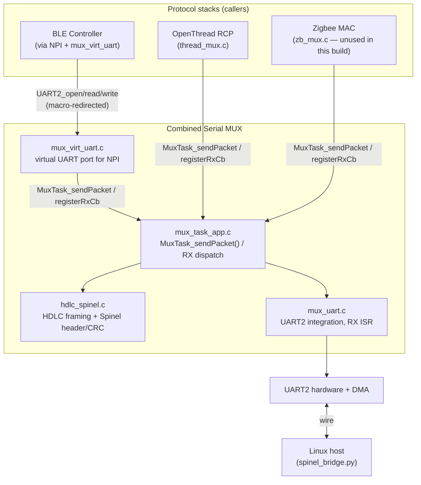
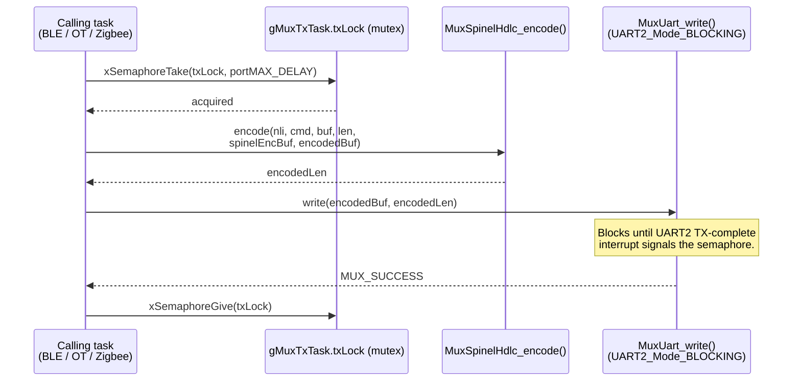
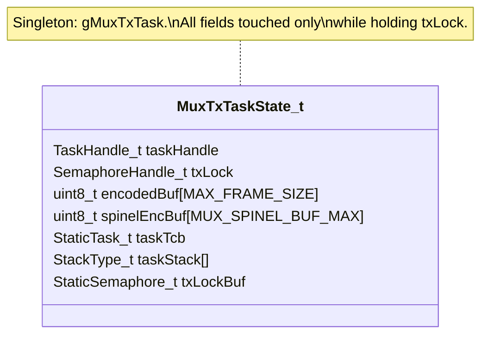
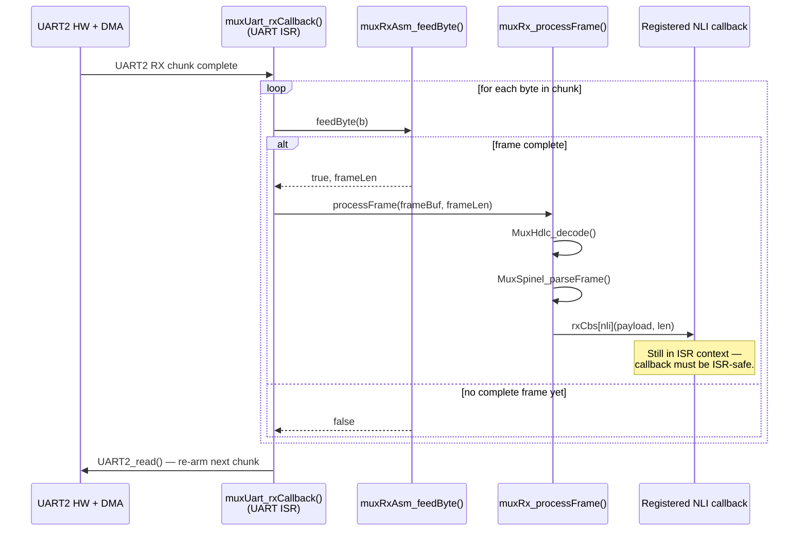
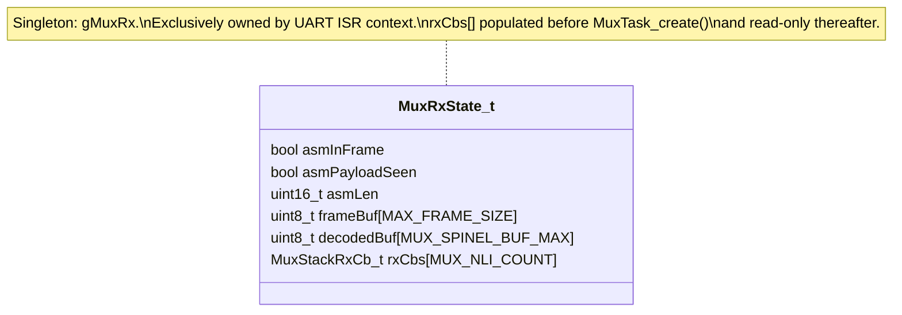
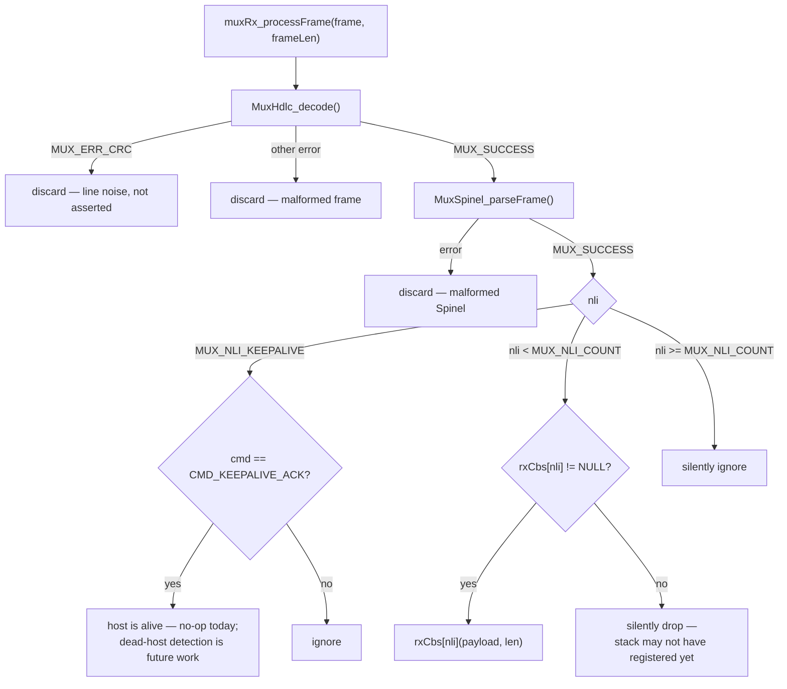
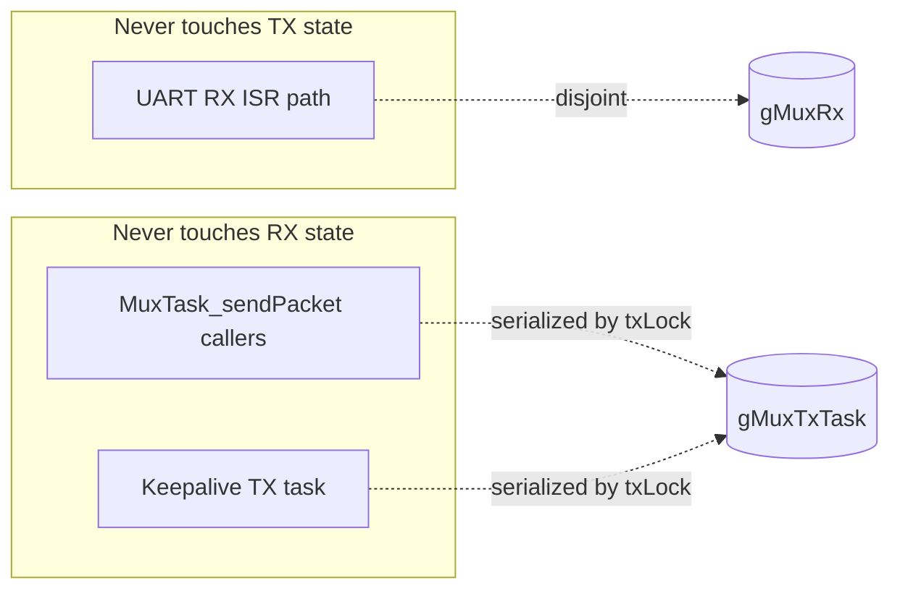
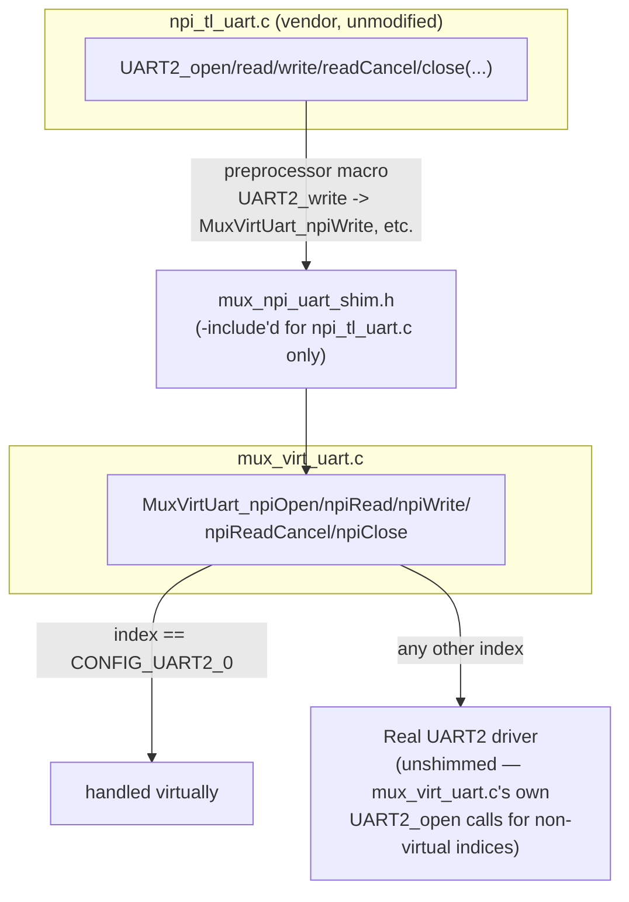

# TI Combined Serial MUX — Design Document (HLD/LLD)

> Audience: engineers modifying, reviewing, or debugging this module
> internally. For integration instructions, see [API_GUIDE.md](API_GUIDE.md).

## 1. High-Level Design

### 1.1 Goals and constraints

- Multiplex N independent protocol stacks (BLE, OpenThread, Zigbee, ...)
  over a single physical UART, using minimal RAM and no dynamic allocation
  (all state is `static`, all FreeRTOS objects are statically allocated).
- Never let one stack's TX burst stall another stack's RX — this drove the
  RX-in-ISR / synchronous-TX redesign described in §3–4.
- Require **zero source changes** to third-party stack code (BLE's NPI
  transport layer in particular) to integrate with the MUX — solved with a
  compile-time virtual-UART shim (§5).

### 1.2 Component overview



### 1.3 File map

| File | Role |
|---|---|
| `mux_common.h` | Shared constants: NLI IDs, Spinel/HDLC bit definitions, buffer sizes, `MuxErr_t` codes, `MuxStackRxCb_t` typedef. |
| `hdlc_spinel.c/.h` | Pure codec: CRC-16/Kermit, HDLC encode/decode, Spinel packed-uint and frame parse/build. No I/O, no OS dependency — usable on both embedded and host (Linux) builds. |
| `embedded/mux_task_app.c/.h` | The MUX's public API surface: `MuxTask_create()`, `MuxTask_sendPacket()`, `MuxTask_registerRxCb()`. Owns the RX frame assembler and the TX keepalive task. |
| `embedded/mux_uart.c/.h` | UART2 driver integration: opens the physical UART, exposes a blocking write, and forwards every RX chunk (from ISR context) to `mux_task_app.c`. |
| `embedded/mux_virt_uart.c/.h` + `mux_npi_uart_shim.h` | Compile-time shim presenting a *virtual* UART2 port to BLE's NPI transport layer, so NPI's HCI traffic rides the same physical UART without any NPI source changes. |
| `tests/test_hdlc_spinel.c` | Host-buildable unit tests for the codec layer (the only layer with no FreeRTOS/UART2 dependency). |

## 2. TX path — synchronous send, no queue

### 2.1 Why not a queue?

The original design used a FreeRTOS queue + dedicated MUX task: callers
enqueued a message and a task drained it. This meant a caller's send
latency depended on the MUX task actually being *scheduled*, and — more
seriously — a single combined RX+TX task meant a TX burst could starve RX
processing (see §3.1 for how RX was decoupled from this entirely).

The current design removes the queue: `MuxTask_sendPacket()` encodes and
writes to the UART **synchronously, in the caller's own task context**.

**Motivation for running in the caller's context instead of handing off to a
task:**

- **A dedicated TX task adds a scheduling dependency that a direct call
  does not have.** With a queue, a caller's effective send latency is
  "enqueue time + however long until the TX task is next scheduled" — which
  depends on that task's priority relative to everything else runnable,
  not just on the MUX itself. Calling `MuxUart_write()` directly from the
  caller's own context removes that extra hop entirely: the only thing a
  caller can be waiting on is `txLock`, i.e. one other sender finishing one
  send.
- **Deterministic backpressure instead of a queue-depth failure mode.** A
  bounded queue either drops/asserts when full (the old design asserted on
  `xQueueSend` failure) or needs unbounded depth to avoid it. A mutex has
  no such failure mode: a caller under contention simply blocks until the
  lock is free — natural backpressure, no separate "queue full" error path
  to design for or hit in the field.
- **Fewer independent execution contexts depending on each other to make
  progress.** A queue-plus-consumer-task model requires two things to be
  true for a send to complete: the caller must enqueue successfully, *and*
  the consumer task must later be scheduled to drain it. A direct call
  collapses this to one: the calling context itself performs the send, so
  completion depends only on that context resuming after the blocking
  UART2 write — the same interrupt-driven completion the driver already
  relies on, with no additional task-scheduling dependency layered on top.
- **Cost is paid by the sender, not amortized across an unrelated task's
  stack/priority.** Each caller's own task priority governs how quickly its
  send is serviced relative to everything else that task competes with —
  there's no separate "MUX TX task priority" to tune against every
  caller's own scheduling needs.



`txLock` is a single mutex, held only for the duration of one encode + one
blocking UART write — never across any other wait. A caller blocked on
`txLock` is waiting on **whichever other context currently holds it to
finish one send**, not on a separate consumer task being scheduled. This
bounds worst-case send latency to "one other sender's frame time," a much
tighter and more predictable bound than a queue-plus-consumer-task model.

### 2.2 TX state (`MuxTxTaskState_t`)



`encodedBuf` and `spinelEncBuf` are module-static scratch buffers shared by
every caller — safe because `txLock` serializes all access to them, and no
caller retains a pointer into them past the call.

### 2.3 The TX task's only remaining job: keepalive

With sends now synchronous, the FreeRTOS TX task exists solely to send
`CMD_KEEPALIVE` every `MUX_KEEPALIVE_PERIOD_MS` (5 s):

```c
static void muxTxTask_fn(void *arg)
{
    muxTxTask_sendKeepalive();       /* announce presence on boot */
    for (;;) {
        vTaskDelay(pdMS_TO_TICKS(MUX_KEEPALIVE_PERIOD_MS));
        muxTxTask_sendKeepalive();
    }
}
```

It takes the same `txLock` as any other caller — there is no special-casing
for the keepalive path.

## 3. RX path — ISR only, no task

### 3.1 Why?

Once TX no longer depended on a shared task, RX processing was pulled into
the UART ISR directly, for a simple reason: a task-based RX consumer is
only as timely as the scheduler allows it to be, and any lower-priority (or
even equal-priority, pending a blocking TX elsewhere) delay directly adds
to a competing radio protocol's response latency (this matters acutely for
BLE/Thread combined operation, where a delayed Spinel reply can trip a
fixed host-side timeout — see the project's `otbr-agent` DieNow
investigation for a concrete instance of exactly this failure mode). Moving
RX fully into the ISR makes it **inherently independent of what any task is
doing**, including a task blocked inside `MuxTask_sendPacket()`.



All of this — assembler, decoder, Spinel parser, and the registered
callback — executes **before the ISR returns and re-arms the next read**.

### 3.2 The incremental frame assembler (`muxRxAsm_feedByte`)

The RX ring buffer + multi-pass frame extractor used by the old design
(`MuxBuf_extractFrame()`, since removed — see §6) has been replaced with an
incremental byte-at-a-time state machine that processes each byte exactly
once, with no rescanning and no shared buffer between the ISR and any other
context:

```mermaid
stateDiagram-v2
    [*] --> WaitFlag
    WaitFlag --> InFrame: byte == 0x7E
    WaitFlag --> WaitFlag: byte != 0x7E (garbage, discard)

    InFrame --> InFrame: byte != 0x7E (accumulate)
    InFrame --> FrameFillIgnored: byte == 0x7E, no payload seen yet (inter-frame fill)
    FrameFillIgnored --> InFrame

    InFrame --> FrameComplete: byte == 0x7E, payload seen
    FrameComplete --> InFrame: frame handed to muxRx_processFrame();\nthis 0x7E doubles as next frame's opening flag

    InFrame --> WaitFlag: buffer overflow\n(oversized/unterminated frame — discard, resync)
```



State lives in the singleton `gMuxRx` struct (`asmInFrame`, `asmPayloadSeen`,
`asmLen`, `frameBuf[MAX_FRAME_SIZE]`) and is touched **only** from ISR
context — since the UART ISR cannot preempt itself, no locking is needed
around any of it.

### 3.3 RX state (`MuxRxState_t`)



`rxCbs[]` is the one field in this struct with a lifecycle outside the ISR:
it is written by `MuxTask_registerRxCb()` (called from task context, before
`MuxTask_create()`), then only ever *read* from ISR context afterward — so
there is no concurrent-write hazard, and `MuxTask_create()` deliberately
resets only the assembler fields on entry, not the whole struct, to avoid
clobbering already-registered callbacks (see the file-level comment in
`mux_task_app.c` for the historical bug this guards against).

### 3.4 Dispatch by NLI



## 4. Concurrency model summary

| Data | Owner / access rule |
|---|---|
| `gMuxRx.*` (assembler + `rxCbs[]`) | UART ISR only, except `rxCbs[]` writes from task context *before* `MuxTask_create()`. No lock needed. |
| `gMuxTxTask.encodedBuf` / `spinelEncBuf` | Any task context, but only while holding `gMuxTxTask.txLock`. |
| `gMuxTxTask.txLock` | Mutex; held for exactly one encode + one blocking UART write, never across any other wait. |
| Physical UART2 handle (`mux_uart.c`) | TX: `MuxUart_write()` from task context, serialized externally via `txLock`. RX: driven entirely by the UART2 driver's own callback, i.e. ISR context. |

There is **no shared mutable state between the RX and TX paths** — this is
by design and is the reason RX-in-ISR is safe: `gMuxRx` and `gMuxTxTask` are
disjoint module-static structs, so a TX in progress can never block or
corrupt RX processing, and vice versa.



## 5. The NPI virtual-UART shim

BLE's NPI transport layer (`npi_tl_uart.c`, third-party vendor code) is not
modified at all. Instead, a **compile-time macro redirection**, scoped to
that one translation unit, redirects its `UART2_*` calls to MUX-aware
equivalents:



`MuxVirtUart_npiWrite()` forwards the payload to
`MuxTask_sendPacket(MUX_NLI_BLE, ...)`, then **synchronously** fires the
same TX-completion callback sequence the real UART2 driver would
(`eventCb(UART2_EVENT_TX_FINISHED)` → NPI's own `writeCallback`), so NPI's
completion-notification expectations are satisfied without NPI knowing its
"UART" isn't real hardware. `MuxVirtUart_rxNotify()` (registered as the
`MUX_NLI_BLE` RX callback) does the reverse: it appends inbound bytes to a
small ring buffer and delivers them to NPI's registered read callback.

This is why `CONFIG_DISPLAY_UART` is aliased to `CONFIG_UART2_0` in the
build configuration — NPI's `UART2_open(CONFIG_DISPLAY_UART, ...)` call
must resolve to the same index the shim recognizes as "virtual," while the
MUX's own `MuxUart_open()` call (from an *unshimmed* translation unit) opens
the one real, physical UART2 instance at that same index.

## 6. Removed since the last major redesign

Three modules were deleted as dead code after the TX/RX architecture
changes above landed (see git history for the removal commit):

- **`mux_buffer.c/.h`** — the ring-buffer + multi-pass frame extractor used
  by the old task-based RX design. Superseded by the incremental assembler
  in §3.2. (Still used by host-side tooling that predates this redesign;
  removed only from the embedded/test scope described here.)
- **`embedded/ble_mux.c/.h`**, **`embedded/zb_mux.c/.h`** — stack-glue
  modules never wired into any build in this repository (BLE integration
  goes through the NPI virtual-UART shim in §5 instead; no Zigbee stack is
  built here). Kept conceptually documented above only insofar as the
  pattern they implemented — register-then-send — is the same pattern any
  new stack should follow per the [API Guide](API_GUIDE.md#3-quick-start-adding-a-new-stack).

## 7. Known limitations / future work

- **No dead-host detection.** The RX path acknowledges
  `CMD_KEEPALIVE_ACK` but takes no action if the host goes silent — a
  documented gap, left for a future phase.
- **Zigbee path unaudited for ISR-safety.** `zb_mux.c`'s callback has not
  been confirmed ISR-safe under the current RX-in-ISR model (moot in this
  build, since Zigbee isn't wired in, but relevant if it is reintroduced).
- **`NPI_FLOW_CTRL == 1` is not interceptable** by the virtual UART shim —
  that path directly dereferences the UART2 handle's `hwAttrs`, bypassing
  the macro redirection. This build uses `NPI_FLOW_CTRL == 0`.
- **Single physical UART is a hard bandwidth ceiling.** All NLIs compete
  for the same wire; there is no per-NLI priority or fairness scheme at the
  MUX layer today (fairness between BLE and Thread radio time is handled
  by DMM, a separate layer, not by this MUX).
